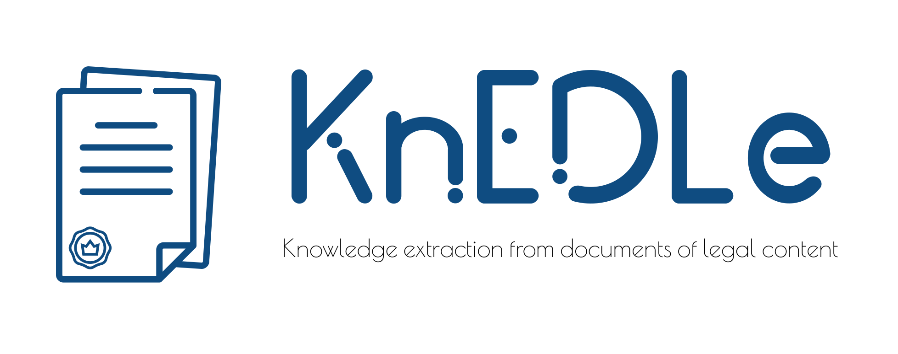

### DODFMiner

DODFMiner is the software that is being developed for the extraction of data from documents in PDF format referring to the publications of the Official Gazette of the Federal District, Brazil.

### Contribute

If you want to contribute to our project, it's simple! We have a [Contribution Guide](CONTRIBUTING.md) where all the steps to contribute are explained.
Don't forget to also read our [Code of Conduct](CODE_OF_CONDUCT.md).
If you have any questions you can also contact us by creating an issue or by ask.knedle@googlegroups.com

### Installation

To run the project environment, access our [installation guide](https://dodfminer.readthedocs.io/en/stable/user/install.html).

### Documentation

To access our documentation and understand how to install and use the library, [Read The Docs](https://dodfminer.readthedocs.io).

### Collaborators

The information of [collaborators](https://unb-knedle.github.io/#members) can be accessed on our page.

