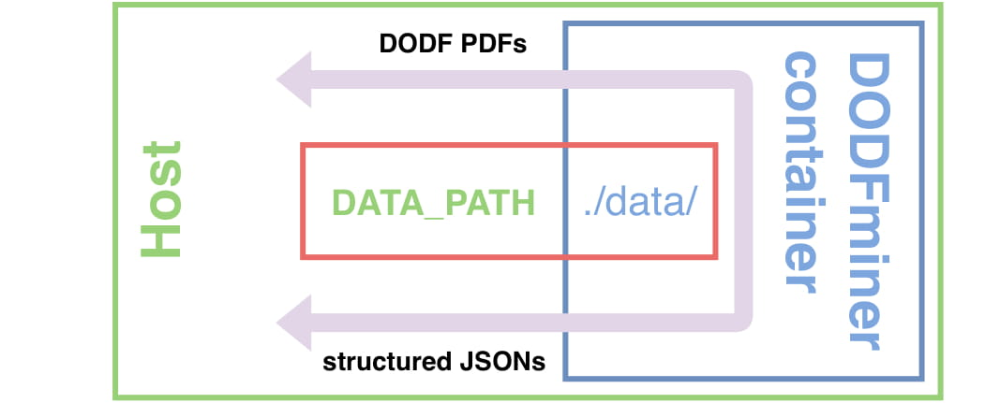

============
Installation
============

DODFMiner is currently only supported on Linux and OSX. It may be possible to install on Windows, though this hasn’t been extensively tested. 

Requirements
============

- Python3
- MuPDF
- pdfinfo

Installation Methods
====================

We support two method of installation. The Library method (recommended), and a Docker Install.

Library Install
---------------

::

    git clone https://github.com/UnB-KnEDLe/DODFMiner.git
    cd dodfminer
    pip install -e .

Docker Install
--------------

Since this project have several dependencies outside Python libraries, there is
a DockerFile and a Compose file provided to facilitate the correct execution. The DockerFile contains instructions on how the image is build,
while the Compose file contains instruction on how to run the image.

The container created by the DockerFile image use a DATA_PATH environment
variable as the location to save the downloaded DODF PDFs and the extracted JSONs. This variable needs to be set before the execution.

To build and execute the image the docker and docker-compose
need to be correct installed:

1. [Install Docker](https://docs.docker.com/compose/environment-variables/)

2. [Install Docker Compose](https://docs.docker.com/compose/install/)

After the installation, the first thing that docker needs is an image. To create the image run the following command in the root of the project::

    $ docker-compose build

This can took a while to finish.

Now, with the image created, the docker-compose can generate instances (containers) of this image to run specifics tasks.

::

    $ export DATA_PATH=/path/to/save/files/ \
    $ sudo -E docker-compose run dodfminer -sd 01/19 -ed 01/19

This command executes the download task, where -st is the start date and -ed is the end date, representing the interval that the DODFs will be downloaded.

Other arguments can be found excuting the command:

:: 

    $ export DATA_PATH=/path/to/save/files/ \
    $ sudo -E docker-compose run dodfminer --help

.. note::
    1. If your docker is already in the _sudo_ group you can
    execute without _sudo_, otherwise the -E argument is needed for
    _sudo_ use the environment variables declared in login _bash_.

    2. The container will not work if the DATA_PATH is not defined in the environment. 